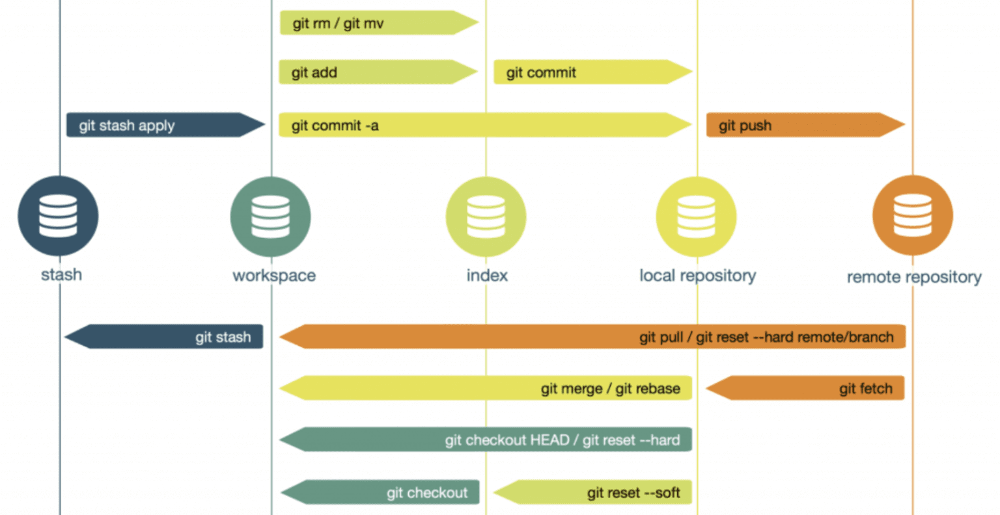

# Tutorial

# Tutorial of Git & GitHub

This is a simple tutorial for beginners to quickly get started to work with Git & GitHub.

## 1. Introduction

## 1.1 What is Git ?

Git is a free & open-sourced *"**distributed"** version control system* (DVCS) .

> ✏ **Note:**
> 
> - Version Control System:
>     - Can easily recall earlier versions of individual files or the project.
>     - Allows team members to work on a project at the same time without impacting each other.
> - Centralized Version Control System (CVCS) v.s. Distributed Version Control System (DVCS)
>     - CVCS relies on a central server for version control operations and collaboration.
>     - DVCS provides everyone with a complete copy of the repository, enabling decentralized work, offline capabilities, and flexible collaboration.

## 1.2 What is GitHub ?

GitHub is a cloud platform that uses Git as its core technology and it acts as the “remote repository” in Git.

## 2. Getting Started with Git

## 2.1 Installation

- For Windows User:
    
    Download from Git Official Website: [https://git-scm.com/download/win](https://git-scm.com/download/win)
    
    After installation, make sure your Git(`C:\Program Files\Git\cmd`) is in your environment variable(環境變數).
    
- For Mac User:
    
    ```bash
    brew install git
    ```
    
- For Linux User:
    
    ```bash
    apt-get install git
    ```
    

## 2.2 Configure Git

- Check if Git is installed : `git --version`
- Essential Configuation :
    
    ```bash
    git config --global user.name "_Your_Username_"
    git config --global user.email "_Your_Email_"
    ```
    
- Check your global config of git : `git config --list`

## 2.3 Git Flow



> 📃 **Terminology**
> 
> - The **most recent commit** on a branch is called the *`head`.*
> - The **default branch** is called *`master`*.
> - The *`head`* **of the current branch** is called `*HEAD*`.
>     - Git will create a remote named `*origin*`. It is the default remote for push and pull operations when you create a repo.

> 📌 **Four Basic Steps for Git:**
> 
> 1. Initialize `.git` repository in your workspace.
> 2. Create index for Git.
> 3. Commit files to **local repository**.
> 4. Push files to **********************************remote repository**********************************.

### [1] Initialize `.git` repository in your workspace

```bash
# Option 1: Initialize locally
git init

# Option 2: Clone from a remote repository (GitHub)
git clone _Repo_URI_

# Option 3: Clone from a remote repository (GitHub) with specific branch
git clone _Repo_URI_ -b _Branch_Name_
```

### [2] Create index for Git

- In this step, we tell Git which file(s) should be tracked in the workspace.

```bash
# Option 1: To add all the files in the workspace
git add .

# Option 2: To add specific file(s) only
git add _fileName1_ _fileName2_
```

### [3] Commit to local repository

```bash
git commit -m "_Your_Commit_Message_"
```

> ✏ **Note:**
> 
> - `git commit --amend`
>     - 👉 To modify your latest commit.
>     - Usage :
>         - `git commit --amend -m "__Your_Commit_Message__"` : Modify your latest commit message.
>         - `git commit --amend --no-edit` : If you forget to add some files in your previous commit, this allows you to commit agian without changing previous commit message
>     - ⚠ It is always a bad idea to change any commits that have been shared with another developer!!
>         
>         [ Other method to modify your commit : `git reset`, `git rebase` ]
>         

> 📏 **Conventions:**
> 
> - Don’t end your commit message with a period.
> - Keep your commit messages to 50 characters or less.
> - Use active voice. For example, "add" instead of "added" and "merge" instead of "merged".

### [4] (Optional) Push to remote repository (GitHub)

```bash
# Push branch with default settings
git push

# Push all the branch
git push --all origin

# Push target branch to remote repository
git push origin _Your_Branch_Name_
```

> ✏ **Note:**
> 
> - `git remote add _Customed_Name_ _Targer_URL_`
>     - 👉 To add remote repository to git
>     - Commonly used : `git remote add origin _YOUR_URL_`
> - `git push -u origin _Branch_Name_`
>     - `-u` : Equivalent to `--set-upstream` . It will configure the default settings for `push`

## 2.4 Other Common Git Command

- `git status`
    - 👉 To check current status of the working tree.
- `git log`
    - 👉 To review all of your commits.
    - Other Options :
        - `git log --oneline` : To produce a more concise listing.
        - `git log --nX` : This will only list out the latest **X** commits.
- `git diff`
    - To see what had changed.
    - The default is to show you all of the changes that haven't been added.
    - Other Options :
        - `git diff HEAD` : To compare the working tree to the last commit.

## 3. Working with GitHub

## 3.1 GitHub Flow


## 3.2 GitHub Functionalities

### Issues


- Most of the communication between a project's consumers and development team occurs here.
- Containing bug reports, feature requests, documentation clarifications, and more.

### Pull requests


- Code review before merging into main (master) branch.

### Branches


- The best way to keep branches organized with a team is to keep them concise and short-lived.
- A single branch should represent a single new feature or bug fix.

> Common Used Command for Branches :
> 
> - `git branch` : To list all the branches.
>     - Other Option:
>         - `git branch _New_Branch_Name_` : Create a new branch with specific name
> - `git checkout`
>     - Usage :
>         - `git checkout _Branch_Name_` : Switch to target branch
>         - `git checkout -b _Branch_Name_` : Create if not exist and switch to target branch
>         - `git checkout -d _Branch_Name_` : Delete target branch
>             - Note: Cannot delete current working branch.
>     - Note : Can also be used to recover a deleted file

### Cloning and forking


- Cloning a Repository
    - Make a copy of the repository and its history **on your local machine**.
- Forking a Repository
    - Makes a copy of the repository **in your GitHub account**.
    - Once you've forked a repository into your GitHub account you can clone it to your local machine.
    - Forking allows you to freely make changes to a project without affecting the original upstream repository.
    - To contribute changes back to the upstream repository you create a pull request from your forked repository.

> 💡 When to `clone` or `fork`?
> 
> - If you have write access to the repository : `clone`
> - If you don’t have write access to the repository : `fork`

### Special Files

- ✨ `README.md`
    - Gives other users information of the whole project
- ✨ `.gitignore`
    - To specify which files and directories should be ignored and not tracked.
    - Allowing you to exclude files like build artifacts, temporary files, and sensitive information
    - Example :
    
    ```
    # ignore all files ends with .py
    *.py
    
    # ignore directory named MyDirectory and its subdirectories
    MyDirectory/
    
    # ignore a directory but exclude a specific subdirectory within it
    !MyDirectory/important
    ```
    
- `CONTRIBUTING.md`
    - Describe the process for contributing to the repository.
    - A link to the CONTRIBUTING.md file is shown anytime someone creates a new issue or pull request.
- `ISSUE_TEMPLATE.md`
    - Is another file you can use to pre-populate the body of an issue.
    - Example: 
    If you always need the same types of information for bug reports, include it in the issue template, and every new issue will be opened with your recommended starter text.

## 3.3 GitHub SSH Key/Personal Access Token

Since some repositories were “private”, generating a SSH Key or Personal Access Token is needed to clone the private repo.  (Note: GitHub diable cloning private repos with HTTPS)

### SSH Key

- Generate SSH Key on your computer
    1. Open your terminal
    2. Enter the following code:
        
        ```bash
        ssh-keygen -t rsa -b 4096 -C "your_email@example.com"
        # You can replace the email associated with your GitHub account
        ```
        
    3. Choose the directory and file name to save.
        
        ```bash
        > Enter file in which to save the key: [Type a name or path]
        ```
        
    4. Set up your password for SSH: (Press Enter for empty)
        
        ```bash
        > Enter passphrase (empty for no passphrase): [Type a passphrase]
        > Enter same passphrase again: [Type passphrase again]
        ```
        
    5. Output may look like this:
        
        
        
    6. Go to the directory where you saved. There are two files:
        1. `id_rsa` : private key ⇒ For self use!! DON’T UPLOAD!!
        2. `id_rsa.pub` : public key ⇒ For other system used!
- GitHub Account Setting

|    |   |
|  ----  | ----  |
| |  |


- Copy the previous pub key to github.
- Test the ssh connection
    
    ```bash
    # Open your terminal and enter
    ssh -T git@github.com
    ```
    

### Personal Access Token

- Pure Account Setting

|    |   |
|  ----  | ----  |
|   |  |
  


## 4 Review (Cheat Sheet)

- If you want to upload a local repository to GitHub

```bash
# ===== 1st Time Push =====
git init
git branch -M main   # Force rename current branch to 'main'
git remote add origin _Your_GitHub_repo_URL_

# ... After modified some files ...
git add .
git commit -m "_YourMessage_"
git push -u origin main
```

```bash
# ===== Future Push =====
git pull   # Check if there is any update of the remote repo

# ... After modified some files ...
git add .
git commit -m "_YourMessage_"
git push
```

- If you want to develop an existing repository on GitHub

```bash
# ===== 1st Time Push =====
git clone _Target_URL_

# Create a new branch
git checkout -b _Branch_Name_

# ... After modified some files ...
git add .
git commit -m "_YourMessage_"
git push -u origin _Branch_Name_
```

```bash
# ===== Future Push =====
git pull

# ... After modified some files ...
git add .
git commit -m "_YourMessage_"
git push
```